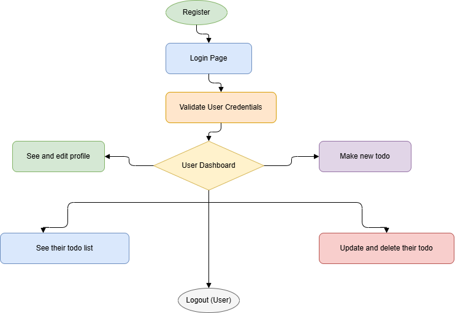

# 🧭 Todo List App — Alur & Teknologi

## 🔄 Penjelasan Alur (User Flow)

   # 📚 Todo List

   > Aplikasi Todo List sederhana yang menggunakan React.js di frontend, Node.js + Express di backend, PostgreSQL sebagai database, Sequelize sebagai ORM, dan JWT untuk autentikasi.

   ## 📊 Diagram Flow

   

   Gambar di atas menggambarkan alur utama (user flow) aplikasi Todo List: dari registrasi hingga manajemen tugas dan logout.

   ### 🔄 Penjelasan Alur (User Flow)

   1. Register

      - Pengguna baru mendaftar dengan mengisi nama, email, dan password.
      - Data dikirim ke backend melalui API Express.js dan disimpan ke PostgreSQL menggunakan Sequelize.

   2. Login Page

      - Setelah terdaftar, pengguna menuju halaman login yang dibangun dengan React.js.
      - Form login mengirimkan kredensial ke backend (Node.js + Express) untuk verifikasi.

   3. Validate User Credentials

      - Backend memvalidasi kredensial.
      - Jika valid, backend membuat JWT dan mengirimkannya ke frontend untuk autentikasi sesi.

   4. User Dashboard

      - Setelah login, pengguna diarahkan ke dashboard di mana mereka dapat:
        - Melihat dan mengedit profil.
        - Membuat todo baru.
        - Melihat daftar todo miliknya.
        - Mengupdate atau menghapus todo.
      - Semua operasi data dilakukan melalui RESTful API, dan diakses dari frontend dengan Axios.

   5. Logout (User)
      - Pengguna dapat logout kapan saja.
      - Token JWT dihapus dari localStorage/sessionStorage untuk mengakhiri sesi.

   #### 🧰 Tech Stack

   | Layer    | Teknologi               | Fungsi                                                      |
   | -------- | ----------------------- | ----------------------------------------------------------- |
   | Frontend | ⚛️ React.js             | Membangun tampilan interaktif dan responsive.               |
   | Backend  | 🟢 Node.js + Express.js | Menangani API, autentikasi, dan logika bisnis.              |
   | Database | 🐘 PostgreSQL           | Menyimpan data user, todo, dan profil secara relasional.    |
   | ORM      | 🔗 Sequelize            | Mempermudah interaksi dengan database menggunakan model JS. |
   | Auth     | 🔒 JWT                  | Mengelola autentikasi sesi dan otorisasi secara aman.       |